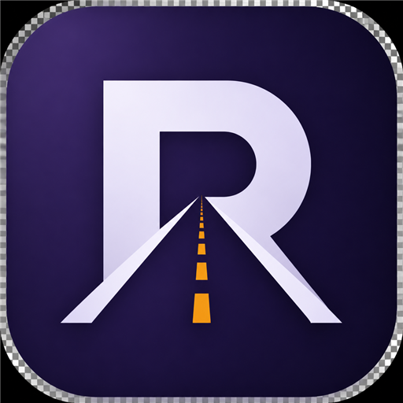

  

<h1 align="center">ROAD</h1>

  <strong>Публикации по расписанию</strong> 
  Десктоп-приложение для YouTube, TikTok и Instagram

  
  
  

---

## О продукте

**ROAD** помогает авторам, блогерам и SMM-специалистам публиковать видео по расписанию — без ручной рутины в браузере.

Загрузите пакет роликов, выберите аккаунты и время — приложение работает в фоне, даже когда окно свёрнуто в трей.

## Возможности

- **Публикации по расписанию** — отложенный постинг на нужное время
- **Пакетная загрузка** — несколько видео за один запуск
- **Несколько аккаунтов** на каждой площадке
- **Фоновый режим** — автозапуск с системой, работа из трея / menu bar
- **Автообновления** — новые версии подтягиваются без переустановки

## Платформы

| Площадка | Формат |
|----------|--------|
| YouTube | Shorts, обычные видео |
| TikTok | Видео |
| Instagram | Reels |

## Скачать

**[Последний релиз →](https://github.com/1lyki02/AutoUploader/releases/latest)**

### Windows

1. Скачайте `ROAD Setup X.X.X.exe`
2. Установите приложение
3. Активируйте лицензионный ключ
4. Подключите аккаунты и создайте первую публикацию

> Windows 10/11 · ~600 МБ · требуется интернет для активации лицензии

### macOS (без подписи Apple)

1. Скачайте `ROAD-X.X.X.dmg` или `ROAD-X.X.X-mac.zip` из [Releases](https://github.com/1lyki02/AutoUploader/releases)
2. Откройте `.dmg` и перетащите ROAD в «Программы»
3. При первом запуске macOS может заблокировать приложение — **ПКМ по ROAD → «Открыть» → «Открыть»**
   - или: **Системные настройки → Конфиденциальность и безопасность → «Всё равно открыть»**
4. Активируйте лицензионный ключ и подключите аккаунты

> macOS 12+ (Apple Silicon и Intel) · ~600 МБ · сборка без Apple Developer подписи

## Поддержка

| | |
|---|---|
| Telegram | [@ROAD_sup](https://t.me/ROAD_sup) |
| Email | [support@road.app](mailto:support@road.app) |

По вопросам оплаты, продления подписки и сброса устройства — пишите в поддержку.

## Для кого

- авторы с регулярным контент-планом
- SMM-специалисты и небольшие агентства
- те, кто публикует Shorts, Reels и TikTok на нескольких площадках

## Репозиторий

Публичная часть монорепозитория ROAD — desktop-клиент (Electron) и общие пакеты автоматизации.

| Компонент | Путь |
|-----------|------|
| Desktop-клиент | `apps/client` |
| Автоматизация загрузок | `packages/automation` |
| Общие типы и схемы | `packages/shared` |

---

  ROAD · Публикации по расписанию

